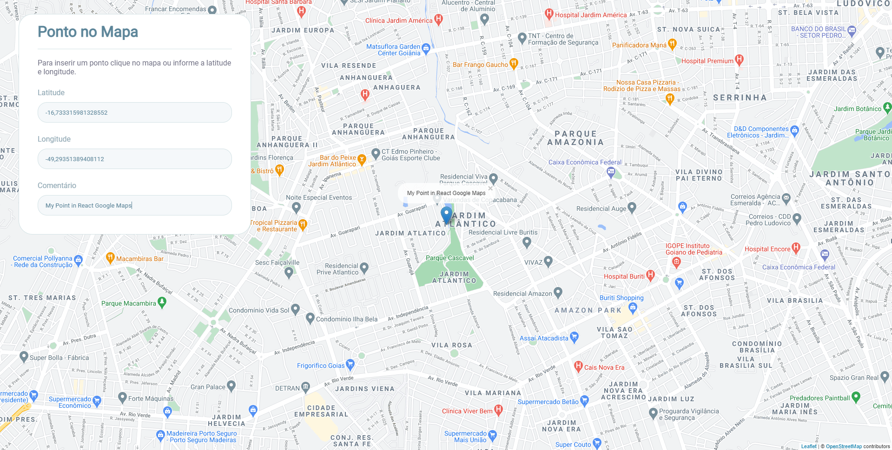

# React Google Maps

  

## Escopo

Este projeto é uma aplicação React com integração do Google Maps através do Leaflet.
O objetivo desta aplicação é mostrar um mapa do Google Maps, com a possibilidade de adicionar um marcador com texto.

## Tecnologias

- react: 17.0.2
- node: 14.16.1
- leaflet: 1.7.1

## Como instalar

- Baixe ou clone este repositório usando `git clone https://github.com/geisonfeitosa/React-Google-Maps.git`.
- Dentro do diretório, execute `npm install` para instalar as dependências.

## Como executar

Dentro do diretório, execute `npm start` para executar a versão de desenvolvimento. Depois acesse `http://localhost:3000/`.

# React Google Maps